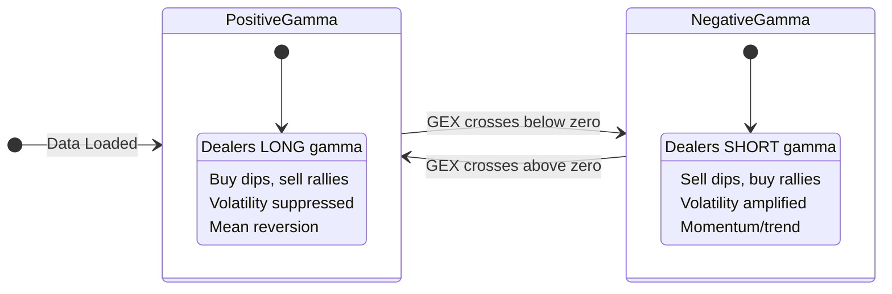
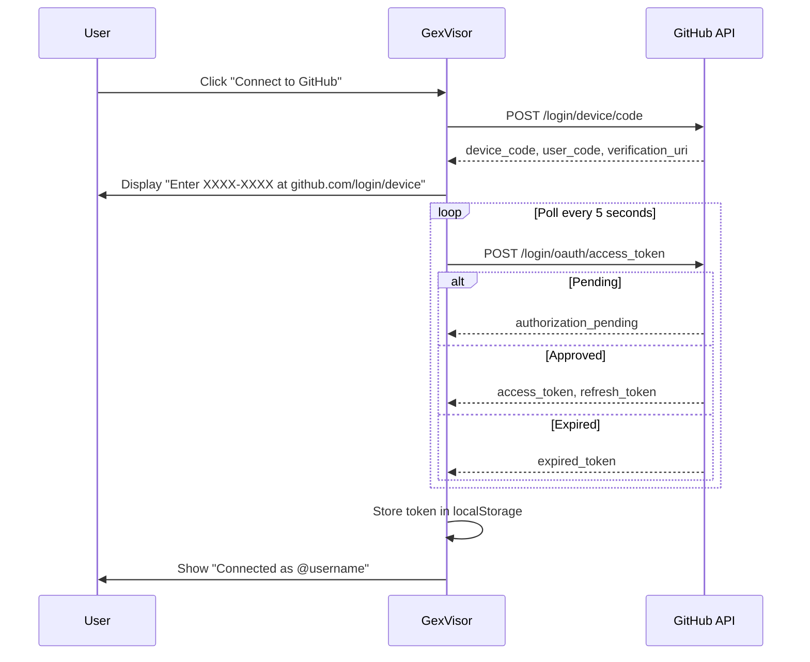
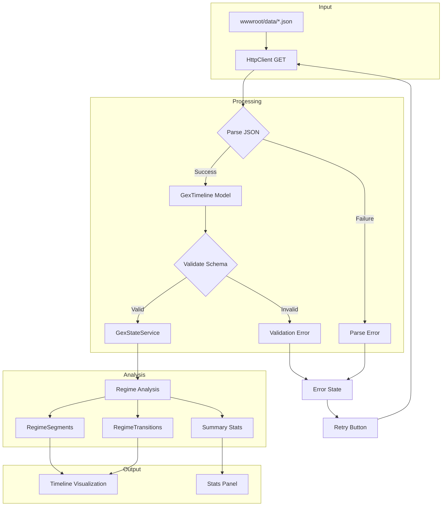
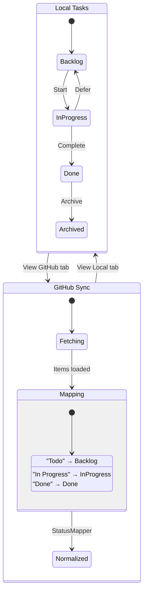
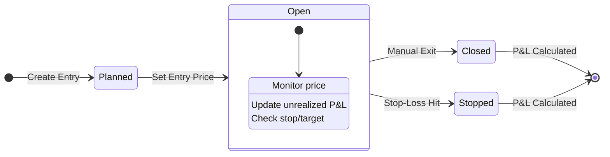
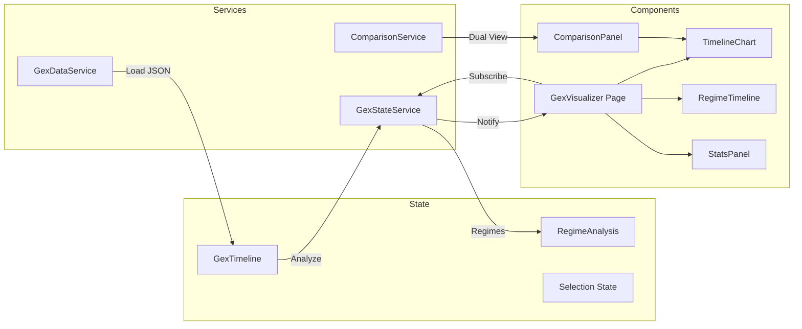
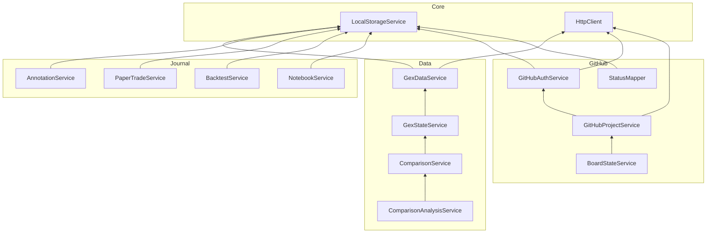
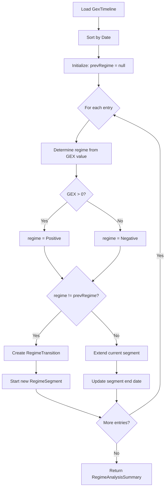

# System Diagrams

Visual documentation of GexVisor architecture and state flows.
These diagrams use [Mermaid](https://mermaid.js.org/) syntax and render natively in GitHub.

## GEX Regime State Machine

The core domain model - dealer gamma exposure determines market behavior.

## GitHub OAuth Device Flow

Authentication sequence for GitHub Projects integration.

## Data Loading Pipeline

Flow from raw JSON files to rendered visualization.

## Task Board State Flow

Local tasks and GitHub-synced items with status mapping.

## Paper Trade Lifecycle

State machine for paper trading journal entries.

## Component Data Flow

How data flows through the GEX Visualizer components.

## Service Dependencies

Dependency graph of GexVisor services.

## Regime Transition Detection

Algorithm for detecting regime changes in GEX data.

---

## Rendering Notes

These diagrams render automatically in:
- **GitHub** - Native Mermaid support in markdown
- **VS Code** - With "Markdown Preview Mermaid Support" extension
- **Notion** - Paste as code block with `mermaid` language

For other environments, use the [Mermaid Live Editor](https://mermaid.live/) to export as SVG/PNG.
