# System Diagrams

Visual documentation of GexVisor architecture and state flows.
These diagrams use [Mermaid](https://mermaid.js.org/) syntax and render natively in GitHub.

## GEX Regime State Machine

The core domain model - dealer gamma exposure determines market behavior.

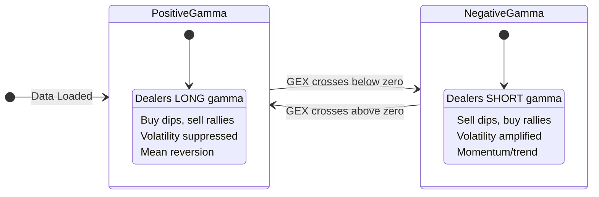

## GitHub OAuth Device Flow

Authentication sequence for GitHub Projects integration.

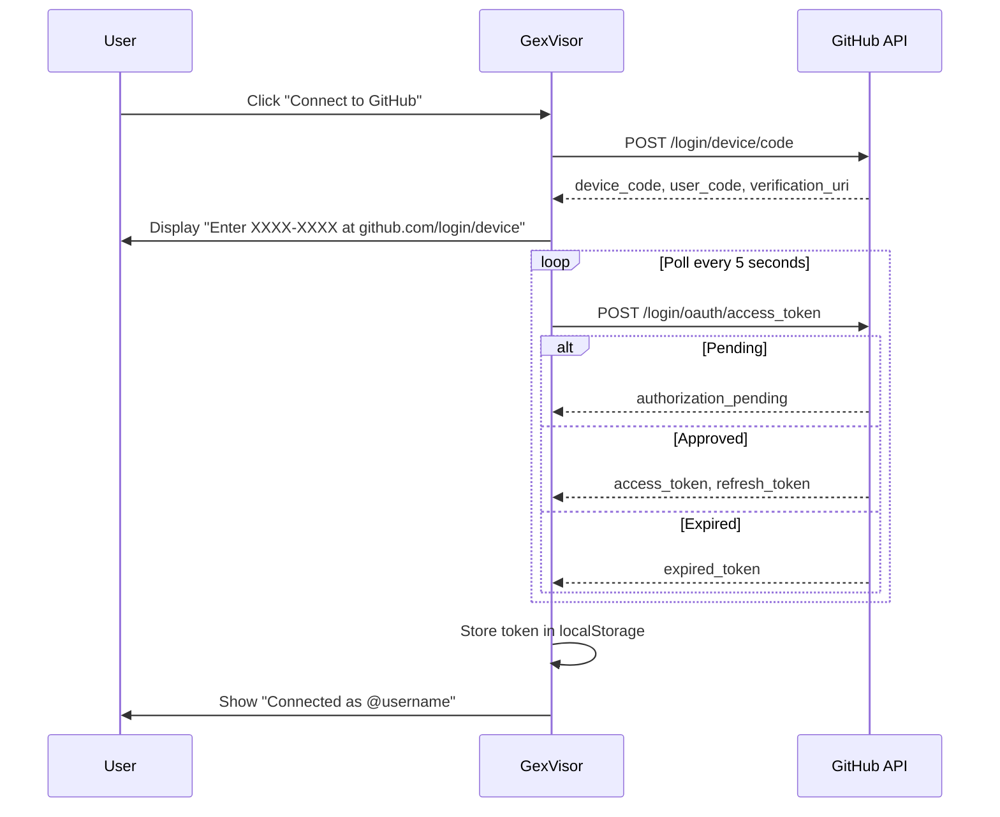

## Data Loading Pipeline

Flow from raw JSON files to rendered visualization.

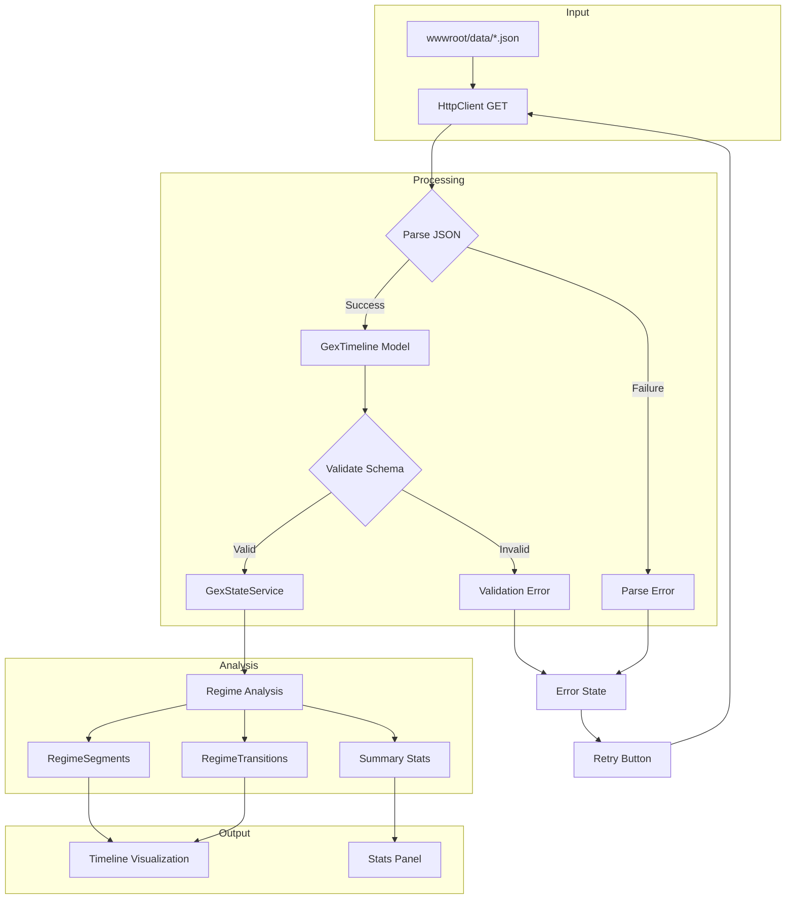

## Task Board State Flow

Local tasks and GitHub-synced items with status mapping.

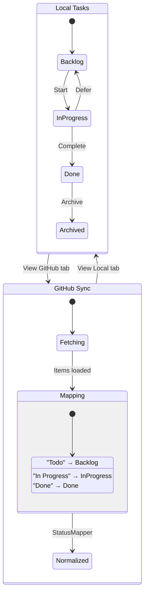

## Paper Trade Lifecycle

State machine for paper trading journal entries.

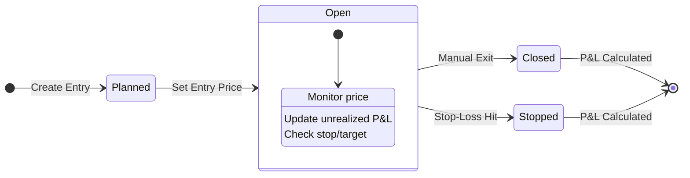

## Component Data Flow

How data flows through the GEX Visualizer components.

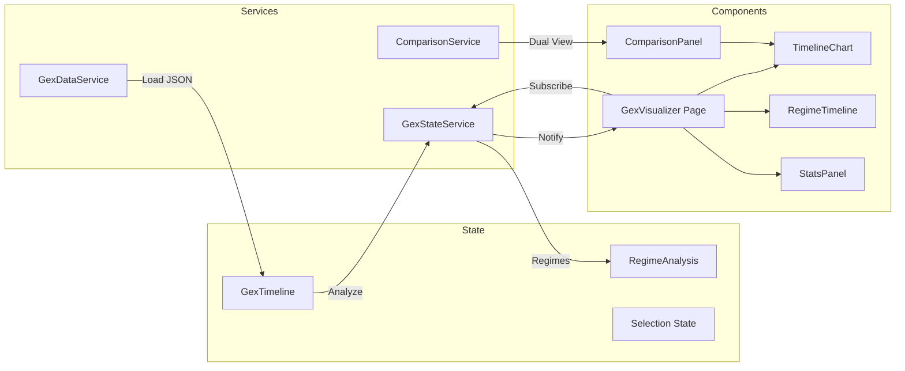

## Service Dependencies

Dependency graph of GexVisor services.

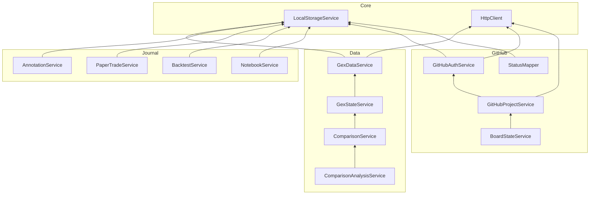

## Regime Transition Detection

Algorithm for detecting regime changes in GEX data.

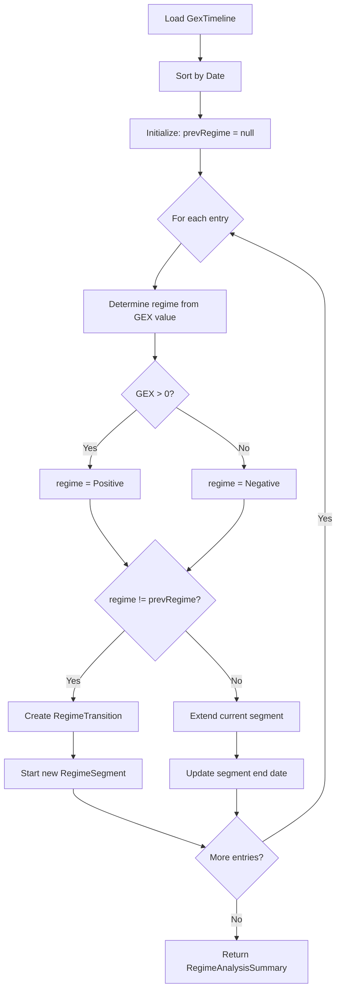

---

## Architecture Deep Dive

The following diagrams provide comprehensive documentation of the system architecture.

### Service Dependency Graph (Complete)

All 20 services with their dependencies and coupling analysis.

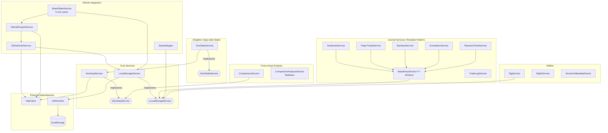

### Complete Data Flow

End-to-end data journey from sources to UI components.

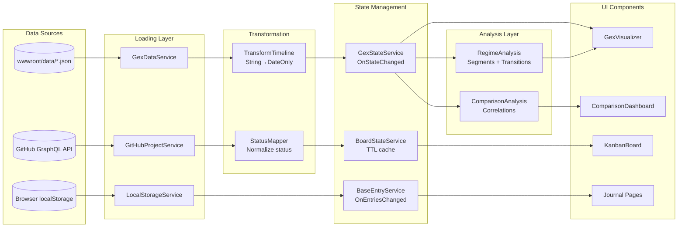

### Event-Driven State Patterns

How components react to state changes.

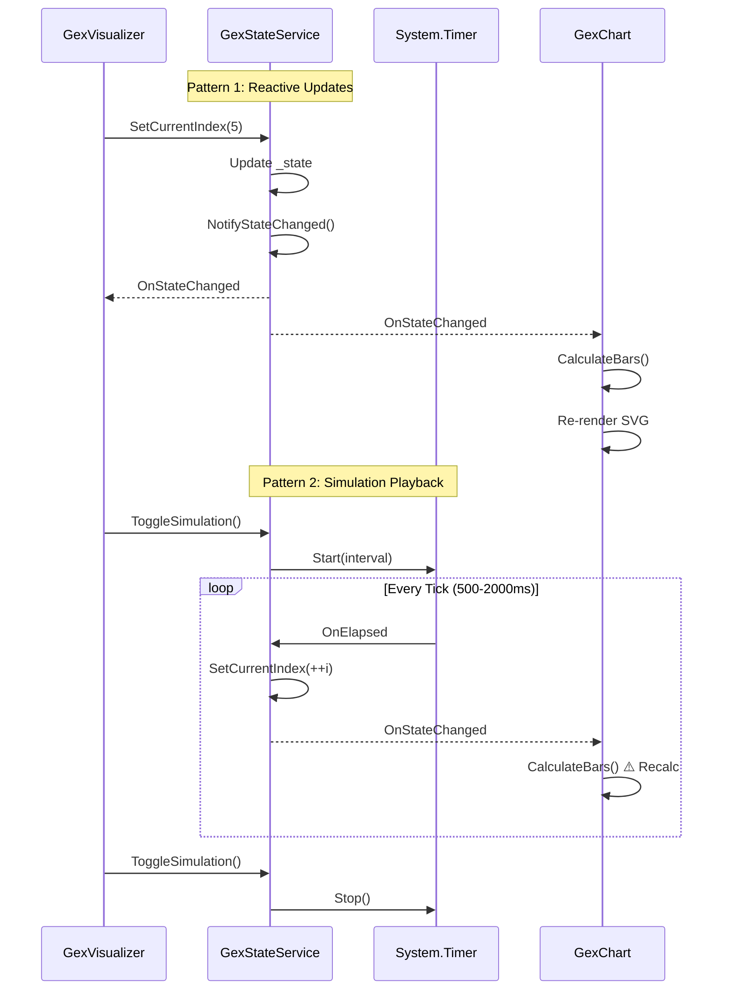

### Component Hierarchy with Service Dependencies

Which services each component depends on.

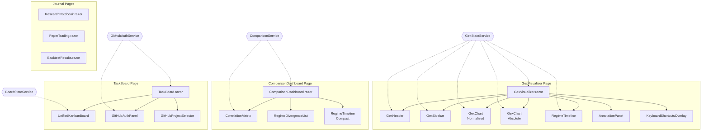

### Entity Relationship Diagram

Domain model relationships.

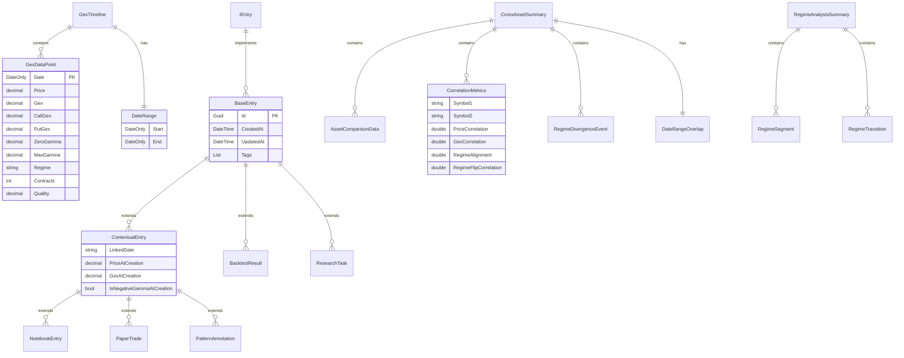

### Caching Strategy (BoardStateService)

TTL-based caching with concurrency guard.

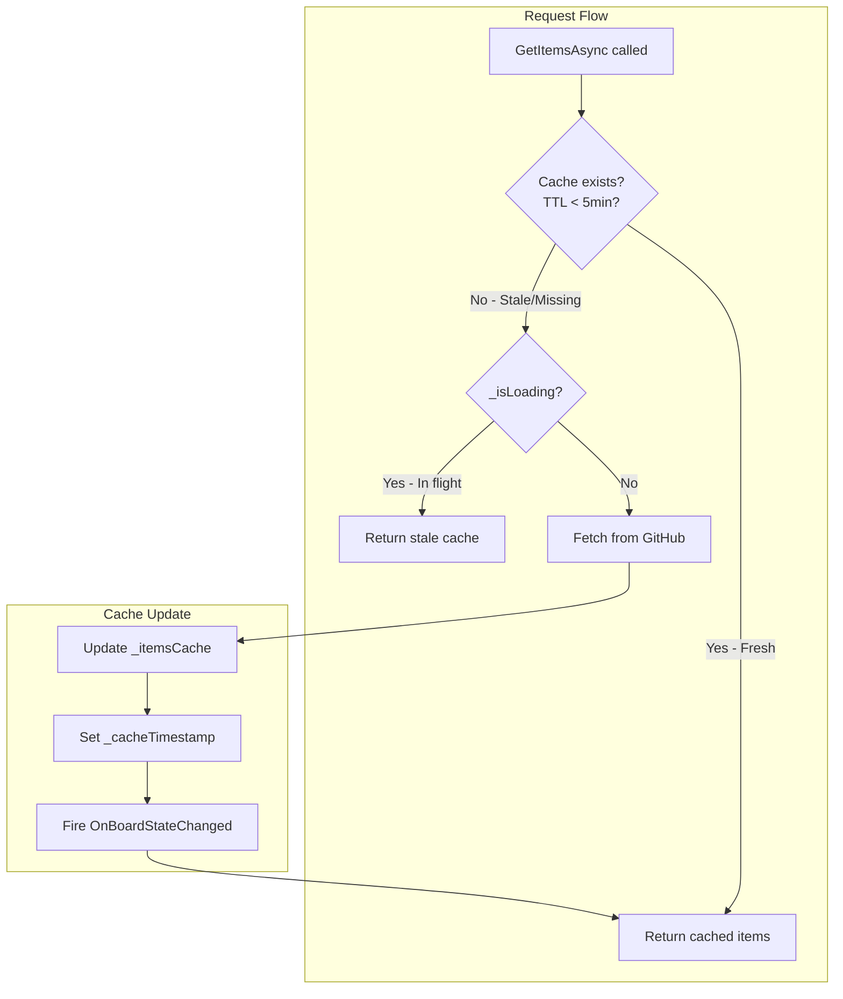

### Journal Entry Lifecycle

BaseEntryService template pattern.

```mermaid
sequenceDiagram
    participant UI as Component
    participant Svc as BaseEntryService&lt;T&gt;
    participant LS as LocalStorageService
    participant JS as Browser

    Note over Svc: Template Method Pattern

    UI->>Svc: LoadAsync()
    Svc->>LS: GetAsync&lt;List&lt;T&gt;&gt;(key)
    LS->>JS: localStorage.getItem
    JS-->>LS: JSON string
    LS-->>Svc: List&lt;T&gt; or default
    Svc->>Svc: Entries = result
    Svc-->>UI: OnEntriesChanged

    UI->>Svc: AddAsync(entry)
    Svc->>Svc: Entries.Insert(0, entry)
    Svc->>Svc: SaveAsync()
    Svc->>LS: SetAsync(key, Entries)
    LS->>JS: localStorage.setItem
    Note over JS: ⚠️ Silent failure possible
    Svc-->>UI: OnEntriesChanged
```

### Cross-Asset Comparison Flow

Multi-symbol loading and analysis.

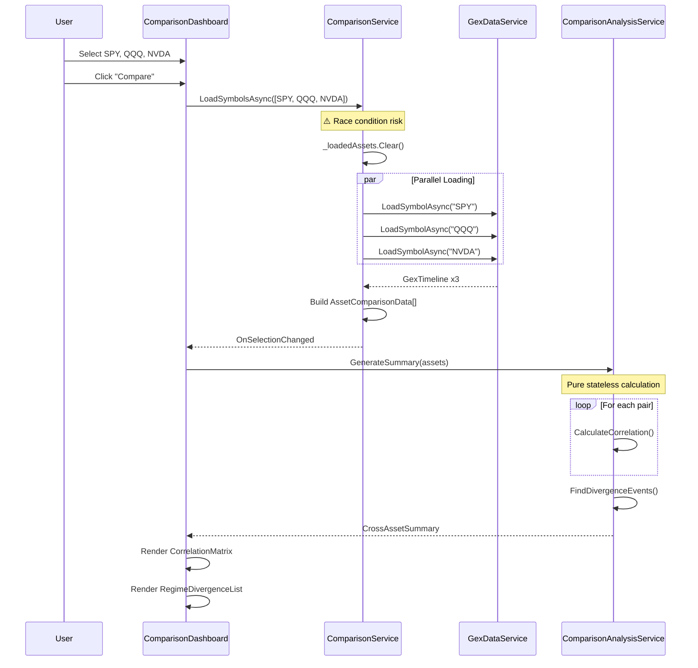

---

## Trade Journal Import Flow

Sequence diagram showing how autotrader logs are imported and processed.

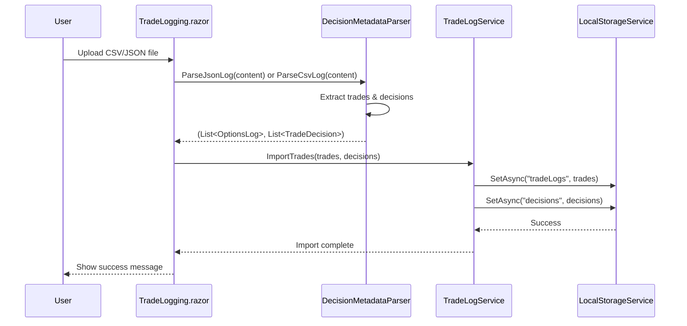

**Key components:**
- **DecisionMetadataParser**: Handles both JSON and CSV formats
- **TradeLogService**: Manages CRUD operations and persistence
- **TradeDecision**: Metadata model with pattern tracking and confidence scores

---

## Trade Decision Context Flow

Graph showing how decision metadata enhances trade display.

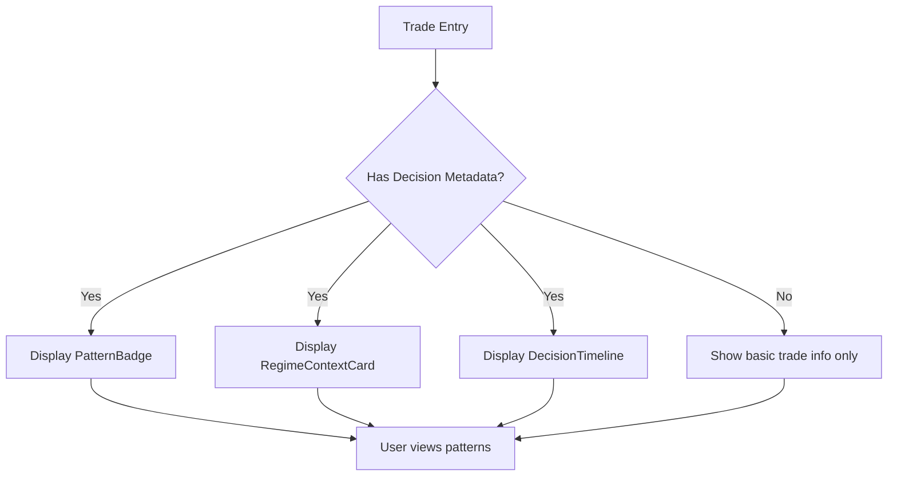

**Decision metadata includes:**
- Active patterns (MECH, PROB, NARR taxonomy)
- Primary trigger signal
- Confidence score (0-1)
- Regime type (Positive γ / Negative γ)
- GEX level at entry
- IV level at entry
- Spot price
- Decision rationale text

---

## Rendering Notes

These diagrams render automatically in:
- **GitHub** - Native Mermaid support in markdown
- **VS Code** - With "Markdown Preview Mermaid Support" extension
- **Notion** - Paste as code block with `mermaid` language

For other environments, use the [Mermaid Live Editor](https://mermaid.live/) to export as SVG/PNG.
