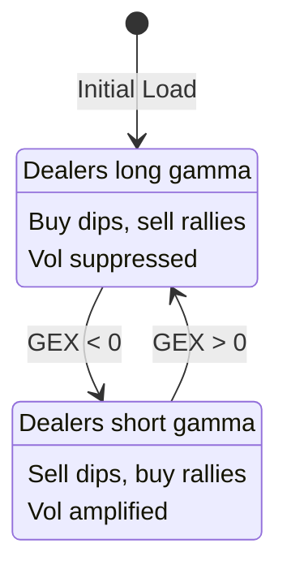

# State Diagrams

Internal documentation of state machines and data flows in GexVisor.

## GEX Regime State Machine

The core domain model representing dealer gamma exposure regimes.

```
                    ┌─────────────────────────────────┐
                    │                                 │
                    ▼                                 │
    ┌───────────────────────────────┐               │
    │       POSITIVE GAMMA          │               │
    │         (+γ Regime)           │               │
    ├───────────────────────────────┤               │
    │ • Net long gamma position     │               │
    │ • Dealers BUY dips            │   GEX crosses │
    │ • Dealers SELL rallies        │   below zero  │
    │ • Volatility SUPPRESSED       │               │
    │ • Mean reversion behavior     │               │
    └───────────────┬───────────────┘               │
                    │                                │
                    │ GEX crosses                    │
                    │ below zero                     │
                    ▼                                │
    ┌───────────────────────────────┐               │
    │       NEGATIVE GAMMA          │               │
    │         (-γ Regime)           │               │
    ├───────────────────────────────┤               │
    │ • Net short gamma position    │               │
    │ • Dealers SELL dips           │   GEX crosses │
    │ • Dealers BUY rallies         │   above zero  │
    │ • Volatility AMPLIFIED        │───────────────┘
    │ • Momentum/trend behavior     │
    └───────────────────────────────┘
```

**Transition triggers:**
- GEX value crosses zero threshold
- Determined by net dealer option positioning
- Typically persists for days/weeks (not intraday)

---

## GitHub OAuth Device Flow

Authentication state machine for GitHub Projects integration.

```
    ┌─────────────┐
    │   INITIAL   │
    │ (No Token)  │
    └──────┬──────┘
           │ User clicks "Connect"
           ▼
    ┌─────────────────────────┐
    │    REQUESTING_CODE      │
    │                         │
    │ POST /login/device/code │
    └───────────┬─────────────┘
                │ Receive device_code + user_code
                ▼
    ┌─────────────────────────────────────┐
    │          AWAITING_USER              │
    │                                     │
    │ Display: "Enter code XXXX-XXXX at   │
    │          github.com/login/device"   │
    │                                     │
    │ [Polling every 5s for token]        │
    └───────────┬─────────────────────────┘
                │
        ┌───────┴───────┐
        │               │
        ▼               ▼
    ┌───────┐     ┌─────────────┐
    │TIMEOUT│     │  APPROVED   │
    │       │     │             │
    │ 15min │     │ Receive     │
    │expired│     │ access_token│
    └───┬───┘     └──────┬──────┘
        │                │
        ▼                ▼
    ┌───────┐     ┌─────────────────┐
    │ ERROR │     │  AUTHENTICATED  │
    │       │     │                 │
    │Restart│     │ Token stored    │
    │ flow  │     │ in localStorage │
    └───────┘     └────────┬────────┘
                           │
                   ┌───────┴───────┐
                   │               │
                   ▼               ▼
            ┌───────────┐   ┌───────────┐
            │  EXPIRED  │   │ LOGOUT    │
            │           │   │           │
            │ Token TTL │   │ User      │
            │ exceeded  │   │ initiated │
            └─────┬─────┘   └─────┬─────┘
                  │               │
                  ▼               ▼
            ┌───────────┐   ┌─────────────┐
            │  REFRESH  │   │   INITIAL   │
            │           │   │             │
            │ Use       │   │ Token       │
            │ refresh   │   │ cleared     │
            │ token     │   └─────────────┘
            └─────┬─────┘
                  │ Success
                  ▼
            ┌─────────────────┐
            │  AUTHENTICATED  │
            └─────────────────┘
```

**Storage keys:**
- `gexvisor.github.token` - Access token
- `gexvisor.github.selectedProject` - Current project

---

## Data Loading Pipeline

State flow from raw data files to visualization.

```
    ┌────────────────────┐
    │    UNINITIALIZED   │
    │                    │
    │ Service created    │
    │ No data loaded     │
    └─────────┬──────────┘
              │ LoadAsync() called
              ▼
    ┌────────────────────┐
    │      LOADING       │
    │                    │
    │ HttpClient GET     │
    │ wwwroot/data/*.json│
    └─────────┬──────────┘
              │
      ┌───────┴───────┐
      │               │
      ▼               ▼
┌───────────┐   ┌───────────────┐
│   ERROR   │   │    PARSING    │
│           │   │               │
│ Network   │   │ Deserialize   │
│ failure   │   │ JSON to       │
│ 404       │   │ GexTimeline   │
└─────┬─────┘   └───────┬───────┘
      │                 │
      │         ┌───────┴───────┐
      │         │               │
      │         ▼               ▼
      │   ┌───────────┐   ┌───────────────┐
      │   │ INVALID   │   │   VALIDATING  │
      │   │           │   │               │
      │   │ Parse     │   │ Check schema  │
      │   │ failed    │   │ Date format   │
      │   └─────┬─────┘   └───────┬───────┘
      │         │                 │
      │         │                 ▼
      │         │         ┌───────────────┐
      │         │         │    LOADED     │
      │         │         │               │
      │         │         │ Data ready    │
      │         │         │ Timeline set  │
      │         │         └───────┬───────┘
      │         │                 │
      │         │                 ▼
      │         │         ┌───────────────┐
      │         │         │   ANALYZED    │
      │         │         │               │
      │         │         │ Regime calc   │
      │         │         │ Stats ready   │
      │         │         │ UI can render │
      │         │         └───────────────┘
      │         │
      ▼         ▼
    ┌─────────────────┐
    │  ERROR_STATE    │
    │                 │
    │ Error message   │
    │ stored for UI   │
    │ RetryAsync()    │
    │ available       │
    └─────────────────┘
```

**Data flow per symbol:**
1. `wwwroot/data/{symbol}_gex.json` loaded
2. Parsed to `GexTimeline` model
3. Regime analysis computed
4. Available via `GexStateService`

---

## Task Board Item States

State machine for task items (local and GitHub-synced).

```
    ┌─────────────────────────────────────────────────────────┐
    │                    LOCAL TASKS                          │
    ├─────────────────────────────────────────────────────────┤
    │                                                         │
    │   ┌──────────┐    ┌─────────────┐    ┌──────────┐      │
    │   │ BACKLOG  │───▶│ IN_PROGRESS │───▶│   DONE   │      │
    │   │          │    │             │    │          │      │
    │   │ Pending  │    │ Active work │    │ Complete │      │
    │   └──────────┘    └─────────────┘    └──────────┘      │
    │        ▲                │                  │            │
    │        │                │                  │            │
    │        └────────────────┴──────────────────┘            │
    │                    (drag to move)                       │
    │                                                         │
    │   Additional states:                                    │
    │   • ARCHIVED - Removed from active view                 │
    │                                                         │
    └─────────────────────────────────────────────────────────┘

    ┌─────────────────────────────────────────────────────────┐
    │                   GITHUB SYNCED                         │
    ├─────────────────────────────────────────────────────────┤
    │                                                         │
    │   GitHub Status Field → StatusMapper → Normalized       │
    │                                                         │
    │   ┌─────────────────────────────────────────────────┐   │
    │   │            STATUS INFERENCE                     │   │
    │   ├─────────────────────────────────────────────────┤   │
    │   │ "Todo", "Open", "Not Started" → BACKLOG         │   │
    │   │ "In Progress", "Doing", "WIP" → IN_PROGRESS     │   │
    │   │ "Done", "Closed", "Resolved"  → DONE            │   │
    │   └─────────────────────────────────────────────────┘   │
    │                                                         │
    │   Item states (from GitHub API):                        │
    │   • OPEN   - Issue/PR is open                          │
    │   • CLOSED - Issue/PR is closed                        │
    │                                                         │
    │   Custom mapping:                                       │
    │   • User can override inferred status                   │
    │   • Stored per-project in localStorage                  │
    │                                                         │
    └─────────────────────────────────────────────────────────┘
```

**Sync behavior:**
- Read-only from GitHub (no write-back)
- 5-minute cache expiry
- Manual refresh available

---

## Paper Trade Lifecycle

State machine for paper trading journal entries.

```
    ┌────────────────┐
    │    PLANNED     │
    │                │
    │ Entry created  │
    │ No execution   │
    └───────┬────────┘
            │ Set entry price/date
            ▼
    ┌────────────────┐
    │     OPEN       │
    │                │
    │ Position held  │
    │ P&L updating   │
    └───────┬────────┘
            │
    ┌───────┴───────┐
    │               │
    ▼               ▼
┌──────────┐  ┌───────────┐
│  CLOSED  │  │ STOPPED   │
│          │  │           │
│ Manual   │  │ Stop-loss │
│ exit     │  │ triggered │
└────┬─────┘  └─────┬─────┘
     │              │
     └──────┬───────┘
            ▼
    ┌────────────────┐
    │   COMPLETED    │
    │                │
    │ Final P&L calc │
    │ Added to stats │
    └────────────────┘
```

**Calculated fields:**
- `UnrealizedPnL` - While OPEN
- `RealizedPnL` - When CLOSED
- `RiskRewardRatio` - Target vs Stop

---

## Backtest Result States

State machine for backtest tracking.

```
    ┌────────────────┐
    │    RUNNING     │
    │                │
    │ Backtest in    │
    │ progress       │
    └───────┬────────┘
            │ Complete
            ▼
    ┌────────────────┐
    │   COMPLETED    │
    │                │
    │ Results ready  │
    │ Metrics calc   │
    └───────┬────────┘
            │
    ┌───────┴───────┐
    │               │
    ▼               ▼
┌──────────┐  ┌───────────┐
│ ARCHIVED │  │ COMPARED  │
│          │  │           │
│ Historical│  │ In active │
│ reference │  │ comparison│
└──────────┘  └───────────┘
```

---

## Comparison View States

State for dual-timeline comparison in GEX Visualizer.

```
    ┌─────────────────┐
    │   SINGLE_VIEW   │
    │                 │
    │ One timeline    │
    │ displayed       │
    └────────┬────────┘
             │ Click "Add Comparison"
             ▼
    ┌─────────────────┐
    │ SELECTING_RIGHT │
    │                 │
    │ Dropdown open   │
    │ Choose symbol   │
    └────────┬────────┘
             │ Symbol selected
             ▼
    ┌─────────────────┐
    │   DUAL_VIEW     │
    │                 │
    │ Left + Right    │
    │ Side by side    │
    ├─────────────────┤
    │ Sync options:   │
    │ • Date range    │
    │ • Zoom level    │
    │ • Scroll        │
    └────────┬────────┘
             │ Click "X" on right panel
             ▼
    ┌─────────────────┐
    │   SINGLE_VIEW   │
    └─────────────────┘
```

---

## Trade Journal Entry Lifecycle

State machine for trade journal entries with decision metadata.

```
    ┌────────────────┐
    │   UNIMPORTED   │
    │                │
    │ Manual entry   │
    │ via form       │
    └───────┬────────┘
            │ Create or import
            ▼
    ┌────────────────┐
    │    IMPORTED    │
    │                │
    │ From autotrader│
    │ CSV/JSON file  │
    └───────┬────────┘
            │ Parser extracts
            │ metadata
            ▼
    ┌────────────────┐
    │    DISPLAYED   │
    │                │
    │ In TradeGrid   │
    │ With metadata  │
    ├────────────────┤
    │ Shows:         │
    │ • PatternBadge │
    │ • RegimeCard   │
    │ • Decision     │
    │   Timeline     │
    └───────┬────────┘
            │
    ┌───────┴───────┐
    │               │
    ▼               ▼
┌──────────┐  ┌──────────┐
│  EDITED  │  │ EXPORTED │
│          │  │          │
│ User     │  │ Export to│
│ modifies │  │ CSV/JSON │
└────┬─────┘  └────┬─────┘
     │              │
     ▼              │
┌──────────┐       │
│ DELETED  │       │
│          │       │
│ Removed  │       │
│ from log │       │
└──────────┘       │
     │             │
     ▼             ▼
    [*]           [*]
```

**Metadata fields:**
- Active patterns (MECH/PROB/NARR taxonomy)
- Confidence score (0-1)
- Regime context (Positive γ / Negative γ)
- Primary trigger signal
- Decision rationale text

---

## Autotrader Log Import Process

Data flow for importing external trading logs.

```
    ┌────────────────┐
    │ FILE_SELECTED  │
    │                │
    │ User uploads   │
    │ CSV or JSON    │
    └───────┬────────┘
            │
            ▼
    ┌────────────────┐
    │    PARSING     │
    │                │
    │ DecisionMeta   │
    │ dataParser     │
    ├────────────────┤
    │ • Parse JSON   │
    │ • Parse CSV    │
    │ • Extract      │
    │   trades       │
    │ • Extract      │
    │   decisions    │
    └───────┬────────┘
            │
    ┌───────┴───────┐
    │               │
    ▼               ▼
┌──────────┐  ┌───────────┐
│  ERROR   │  │ VALIDATED │
│          │  │           │
│ Invalid  │  │ Required  │
│ format   │  │ fields OK │
│ Missing  │  └─────┬─────┘
│ fields   │        │
└────┬─────┘        ▼
     │      ┌───────────────┐
     │      │   IMPORTED    │
     │      │               │
     │      │ TradeLogSvc   │
     │      │ .ImportTrades │
     │      ├───────────────┤
     │      │ • Merge with  │
     │      │   existing    │
     │      │ • Save to     │
     │      │   localStorage│
     │      │ • Fire event  │
     │      └───────┬───────┘
     │              │
     ▼              ▼
    ┌─────────────────┐
    │  ERROR_STATE    │
    │                 │
    │ Display message │
    │ Retry possible  │
    └─────────────────┘
```

**Supported formats:**
- JSON: AutotraderLogEntry array
- CSV: Configurable columns with fallbacks
  - EntryPrice/Entry
  - Timestamp/Date
  - Quantity
  - Strike/StrikePrice

**Parser features:**
- Case-insensitive column matching
- Quoted field support in CSV
- Validates numeric fields before import
- Skips rows with invalid data

---

## Rendering Format

These diagrams use ASCII art for maximum compatibility. For richer rendering:

- **Mermaid**: Add to `.md` files with ` ```mermaid ` blocks
- **SVG**: Export from diagramming tools to `docs/assets/`
- **PlantUML**: Server-side rendering option

### Mermaid Example (GEX Regime)


