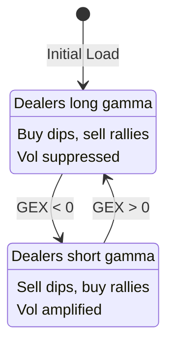

# State Diagrams

Internal documentation of state machines and data flows in GexVisor.

## GEX Regime State Machine

The core domain model representing dealer gamma exposure regimes.

```
                    ┌─────────────────────────────────┐
                    │                                 │
                    ▼                                 │
    ┌───────────────────────────────┐               │
    │       POSITIVE GAMMA          │               │
    │         (+γ Regime)           │               │
    ├───────────────────────────────┤               │
    │ • Net long gamma position     │               │
    │ • Dealers BUY dips            │   GEX crosses │
    │ • Dealers SELL rallies        │   below zero  │
    │ • Volatility SUPPRESSED       │               │
    │ • Mean reversion behavior     │               │
    └───────────────┬───────────────┘               │
                    │                                │
                    │ GEX crosses                    │
                    │ below zero                     │
                    ▼                                │
    ┌───────────────────────────────┐               │
    │       NEGATIVE GAMMA          │               │
    │         (-γ Regime)           │               │
    ├───────────────────────────────┤               │
    │ • Net short gamma position    │               │
    │ • Dealers SELL dips           │   GEX crosses │
    │ • Dealers BUY rallies         │   above zero  │
    │ • Volatility AMPLIFIED        │───────────────┘
    │ • Momentum/trend behavior     │
    └───────────────────────────────┘
```

**Transition triggers:**
- GEX value crosses zero threshold
- Determined by net dealer option positioning
- Typically persists for days/weeks (not intraday)

---

## GitHub OAuth Device Flow

Authentication state machine for GitHub Projects integration.

```
    ┌─────────────┐
    │   INITIAL   │
    │ (No Token)  │
    └──────┬──────┘
           │ User clicks "Connect"
           ▼
    ┌─────────────────────────┐
    │    REQUESTING_CODE      │
    │                         │
    │ POST /login/device/code │
    └───────────┬─────────────┘
                │ Receive device_code + user_code
                ▼
    ┌─────────────────────────────────────┐
    │          AWAITING_USER              │
    │                                     │
    │ Display: "Enter code XXXX-XXXX at   │
    │          github.com/login/device"   │
    │                                     │
    │ [Polling every 5s for token]        │
    └───────────┬─────────────────────────┘
                │
        ┌───────┴───────┐
        │               │
        ▼               ▼
    ┌───────┐     ┌─────────────┐
    │TIMEOUT│     │  APPROVED   │
    │       │     │             │
    │ 15min │     │ Receive     │
    │expired│     │ access_token│
    └───┬───┘     └──────┬──────┘
        │                │
        ▼                ▼
    ┌───────┐     ┌─────────────────┐
    │ ERROR │     │  AUTHENTICATED  │
    │       │     │                 │
    │Restart│     │ Token stored    │
    │ flow  │     │ in localStorage │
    └───────┘     └────────┬────────┘
                           │
                   ┌───────┴───────┐
                   │               │
                   ▼               ▼
            ┌───────────┐   ┌───────────┐
            │  EXPIRED  │   │ LOGOUT    │
            │           │   │           │
            │ Token TTL │   │ User      │
            │ exceeded  │   │ initiated │
            └─────┬─────┘   └─────┬─────┘
                  │               │
                  ▼               ▼
            ┌───────────┐   ┌─────────────┐
            │  REFRESH  │   │   INITIAL   │
            │           │   │             │
            │ Use       │   │ Token       │
            │ refresh   │   │ cleared     │
            │ token     │   └─────────────┘
            └─────┬─────┘
                  │ Success
                  ▼
            ┌─────────────────┐
            │  AUTHENTICATED  │
            └─────────────────┘
```

**Storage keys:**
- `gexvisor.github.token` - Access token
- `gexvisor.github.selectedProject` - Current project

---

## Data Loading Pipeline

State flow from raw data files to visualization.

```
    ┌────────────────────┐
    │    UNINITIALIZED   │
    │                    │
    │ Service created    │
    │ No data loaded     │
    └─────────┬──────────┘
              │ LoadAsync() called
              ▼
    ┌────────────────────┐
    │      LOADING       │
    │                    │
    │ HttpClient GET     │
    │ wwwroot/data/*.json│
    └─────────┬──────────┘
              │
      ┌───────┴───────┐
      │               │
      ▼               ▼
┌───────────┐   ┌───────────────┐
│   ERROR   │   │    PARSING    │
│           │   │               │
│ Network   │   │ Deserialize   │
│ failure   │   │ JSON to       │
│ 404       │   │ GexTimeline   │
└─────┬─────┘   └───────┬───────┘
      │                 │
      │         ┌───────┴───────┐
      │         │               │
      │         ▼               ▼
      │   ┌───────────┐   ┌───────────────┐
      │   │ INVALID   │   │   VALIDATING  │
      │   │           │   │               │
      │   │ Parse     │   │ Check schema  │
      │   │ failed    │   │ Date format   │
      │   └─────┬─────┘   └───────┬───────┘
      │         │                 │
      │         │                 ▼
      │         │         ┌───────────────┐
      │         │         │    LOADED     │
      │         │         │               │
      │         │         │ Data ready    │
      │         │         │ Timeline set  │
      │         │         └───────┬───────┘
      │         │                 │
      │         │                 ▼
      │         │         ┌───────────────┐
      │         │         │   ANALYZED    │
      │         │         │               │
      │         │         │ Regime calc   │
      │         │         │ Stats ready   │
      │         │         │ UI can render │
      │         │         └───────────────┘
      │         │
      ▼         ▼
    ┌─────────────────┐
    │  ERROR_STATE    │
    │                 │
    │ Error message   │
    │ stored for UI   │
    │ RetryAsync()    │
    │ available       │
    └─────────────────┘
```

**Data flow per symbol:**
1. `wwwroot/data/{symbol}.json` loaded (e.g., `spy.json`, `aapl.json`)
2. Parsed to `GexTimeline` model
3. Regime analysis computed
4. Available via `GexStateService`

---

## Task Board Item States

State machine for task items (local and GitHub-synced).

```
    ┌─────────────────────────────────────────────────────────┐
    │                    LOCAL TASKS                          │
    ├─────────────────────────────────────────────────────────┤
    │                                                         │
    │   ┌──────────┐    ┌─────────────┐    ┌──────────┐      │
    │   │ BACKLOG  │───▶│ IN_PROGRESS │───▶│   DONE   │      │
    │   │          │    │             │    │          │      │
    │   │ Pending  │    │ Active work │    │ Complete │      │
    │   └──────────┘    └─────────────┘    └──────────┘      │
    │        ▲                │                  │            │
    │        │                │                  │            │
    │        └────────────────┴──────────────────┘            │
    │                    (drag to move)                       │
    │                                                         │
    │   Additional states:                                    │
    │   • ARCHIVED - Removed from active view                 │
    │                                                         │
    └─────────────────────────────────────────────────────────┘

    ┌─────────────────────────────────────────────────────────┐
    │                   GITHUB SYNCED                         │
    ├─────────────────────────────────────────────────────────┤
    │                                                         │
    │   GitHub Status Field → StatusMapper → Normalized       │
    │                                                         │
    │   ┌─────────────────────────────────────────────────┐   │
    │   │            STATUS INFERENCE                     │   │
    │   ├─────────────────────────────────────────────────┤   │
    │   │ "Todo", "Open", "Not Started" → BACKLOG         │   │
    │   │ "In Progress", "Doing", "WIP" → IN_PROGRESS     │   │
    │   │ "Done", "Closed", "Resolved"  → DONE            │   │
    │   └─────────────────────────────────────────────────┘   │
    │                                                         │
    │   Item states (from GitHub API):                        │
    │   • OPEN   - Issue/PR is open                          │
    │   • CLOSED - Issue/PR is closed                        │
    │                                                         │
    │   Custom mapping:                                       │
    │   • User can override inferred status                   │
    │   • Stored per-project in localStorage                  │
    │                                                         │
    └─────────────────────────────────────────────────────────┘
```

**Sync behavior:**
- Read-only from GitHub (no write-back)
- 5-minute cache expiry
- Manual refresh available

---

## Paper Trade Lifecycle

State machine for paper trading journal entries.

```
    ┌────────────────┐
    │    PLANNED     │
    │                │
    │ Entry created  │
    │ No execution   │
    └───────┬────────┘
            │ Set entry price/date
            ▼
    ┌────────────────┐
    │     OPEN       │
    │                │
    │ Position held  │
    │ P&L updating   │
    └───────┬────────┘
            │
    ┌───────┴───────┐
    │               │
    ▼               ▼
┌──────────┐  ┌───────────┐
│  CLOSED  │  │ STOPPED   │
│          │  │           │
│ Manual   │  │ Stop-loss │
│ exit     │  │ triggered │
└────┬─────┘  └─────┬─────┘
     │              │
     └──────┬───────┘
            ▼
    ┌────────────────┐
    │   COMPLETED    │
    │                │
    │ Final P&L calc │
    │ Added to stats │
    └────────────────┘
```

**Calculated fields:**
- `UnrealizedPnL` - While OPEN
- `RealizedPnL` - When CLOSED
- `RiskRewardRatio` - Target vs Stop

---

## Backtest Result States

State machine for backtest tracking.

```
    ┌────────────────┐
    │    RUNNING     │
    │                │
    │ Backtest in    │
    │ progress       │
    └───────┬────────┘
            │ Complete
            ▼
    ┌────────────────┐
    │   COMPLETED    │
    │                │
    │ Results ready  │
    │ Metrics calc   │
    └───────┬────────┘
            │
    ┌───────┴───────┐
    │               │
    ▼               ▼
┌──────────┐  ┌───────────┐
│ ARCHIVED │  │ COMPARED  │
│          │  │           │
│ Historical│  │ In active │
│ reference │  │ comparison│
└──────────┘  └───────────┘
```

---

## Comparison View States

State for dual-timeline comparison in GEX Visualizer.

```
    ┌─────────────────┐
    │   SINGLE_VIEW   │
    │                 │
    │ One timeline    │
    │ displayed       │
    └────────┬────────┘
             │ Click "Add Comparison"
             ▼
    ┌─────────────────┐
    │ SELECTING_RIGHT │
    │                 │
    │ Dropdown open   │
    │ Choose symbol   │
    └────────┬────────┘
             │ Symbol selected
             ▼
    ┌─────────────────┐
    │   DUAL_VIEW     │
    │                 │
    │ Left + Right    │
    │ Side by side    │
    ├─────────────────┤
    │ Sync options:   │
    │ • Date range    │
    │ • Zoom level    │
    │ • Scroll        │
    └────────┬────────┘
             │ Click "X" on right panel
             ▼
    ┌─────────────────┐
    │   SINGLE_VIEW   │
    └─────────────────┘
```

---

## Trade Journal Entry Lifecycle

State machine for trade journal entries with decision metadata.

```
    ┌────────────────┐
    │   UNIMPORTED   │
    │                │
    │ Manual entry   │
    │ via form       │
    └───────┬────────┘
            │ Create or import
            ▼
    ┌────────────────┐
    │    IMPORTED    │
    │                │
    │ From autotrader│
    │ CSV/JSON file  │
    └───────┬────────┘
            │ Parser extracts
            │ metadata
            ▼
    ┌────────────────┐
    │    DISPLAYED   │
    │                │
    │ In TradeGrid   │
    │ With metadata  │
    ├────────────────┤
    │ Shows:         │
    │ • PatternBadge │
    │ • RegimeCard   │
    │ • Decision     │
    │   Timeline     │
    └───────┬────────┘
            │
    ┌───────┴───────┐
    │               │
    ▼               ▼
┌──────────┐  ┌──────────┐
│  EDITED  │  │ EXPORTED │
│          │  │          │
│ User     │  │ Export to│
│ modifies │  │ CSV/JSON │
└────┬─────┘  └────┬─────┘
     │              │
     ▼              │
┌──────────┐       │
│ DELETED  │       │
│          │       │
│ Removed  │       │
│ from log │       │
└──────────┘       │
     │             │
     ▼             ▼
    [*]           [*]
```

**Metadata fields:**
- Active patterns (MECH/PROB/NARR taxonomy)
- Confidence score (0-1)
- Regime context (Positive γ / Negative γ)
- Primary trigger signal
- Decision rationale text

---

## Autotrader Log Import Process

Data flow for importing external trading logs.

```
    ┌────────────────┐
    │ FILE_SELECTED  │
    │                │
    │ User uploads   │
    │ CSV or JSON    │
    └───────┬────────┘
            │
            ▼
    ┌────────────────┐
    │    PARSING     │
    │                │
    │ DecisionMeta   │
    │ dataParser     │
    ├────────────────┤
    │ • Parse JSON   │
    │ • Parse CSV    │
    │ • Extract      │
    │   trades       │
    │ • Extract      │
    │   decisions    │
    └───────┬────────┘
            │
    ┌───────┴───────┐
    │               │
    ▼               ▼
┌──────────┐  ┌───────────┐
│  ERROR   │  │ VALIDATED │
│          │  │           │
│ Invalid  │  │ Required  │
│ format   │  │ fields OK │
│ Missing  │  └─────┬─────┘
│ fields   │        │
└────┬─────┘        ▼
     │      ┌───────────────┐
     │      │   IMPORTED    │
     │      │               │
     │      │ TradeLogSvc   │
     │      │ .ImportTrades │
     │      ├───────────────┤
     │      │ • Merge with  │
     │      │   existing    │
     │      │ • Save to     │
     │      │   localStorage│
     │      │ • Fire event  │
     │      └───────┬───────┘
     │              │
     ▼              ▼
    ┌─────────────────┐
    │  ERROR_STATE    │
    │                 │
    │ Display message │
    │ Retry possible  │
    └─────────────────┘
```

**Supported formats:**
- JSON: AutotraderLogEntry array
- CSV: Configurable columns with fallbacks
  - EntryPrice/Entry
  - Timestamp/Date
  - Quantity
  - Strike/StrikePrice

**Parser features:**
- Case-insensitive column matching
- Quoted field support in CSV
- Validates numeric fields before import
- Skips rows with invalid data

---

## Rendering Format

These diagrams use ASCII art for maximum compatibility. For richer rendering:

- **Mermaid**: Add to `.md` files with ` ```mermaid ` blocks
- **SVG**: Export from diagramming tools to `docs/assets/`
- **PlantUML**: Server-side rendering option

### Mermaid Example (GEX Regime)



---

## Pattern Discovery & Data Pipeline States

The following sections document the pattern discovery and data pipeline architectures
from the parent [gex-llm-patterns](https://github.com/iAmGiG/gex-llm-patterns) and
companion [AutoGen-Trader](https://github.com/iAmGiG/AutoGen-Trader) projects.

---

## Pattern Validation State Machine

State machine for classifying market patterns as mechanical (structural) or narrative (folkloric).

Source: `gex-llm-patterns/src/validation/pattern_taxonomy.py`

```
    ┌────────────────┐
    │    UNKNOWN     │
    │                │
    │ Pattern newly  │
    │ identified     │
    └───────┬────────┘
            │ Begin validation
            ▼
    ┌────────────────────────────────────────────────┐
    │            UNDER_VALIDATION                    │
    ├────────────────────────────────────────────────┤
    │ Validation Criteria:                           │
    │ • Out-of-sample tests (30+ minimum samples)    │
    │ • Success rate ≥ 60%                           │
    │ • Economic significance (≥20 bps)              │
    │ • Passes obfuscation test (LLM can detect      │
    │   without training data knowledge)             │
    └───────────────────┬────────────────────────────┘
                        │
            ┌───────────┴───────────┐
            │                       │
            ▼                       ▼
    ┌───────────────┐       ┌───────────────┐
    │  MECHANICAL   │       │   NARRATIVE   │
    │               │       │               │
    │ Structural    │       │ Folkloric     │
    │ constraint    │       │ pattern       │
    │ validated     │       │ unverifiable  │
    └───────────────┘       └───────────────┘
```

**Causal Mechanism Structure:**

| Field | Description |
|-------|-------------|
| `constraint` | Market force creating position imbalance |
| `required_action` | Dealer response (hedge/unwind) |
| `why_required` | Regulatory or risk mandate |
| `observable_impact` | Measurable market effect |

---

## Dealer Action State Machine

Constrained action set for dealer responses to gamma exposure positions.

Source: `gex-llm-patterns/src/validation/pattern_taxonomy.py` - `DealerAction` enum

```
    ┌─────────────────────────────────────────────────────────┐
    │              DEALER POSITION CONSTRAINT                  │
    ├─────────────────────────────────────────────────────────┤
    │                                                          │
    │   Current Position + GEX Constraint → Required Action    │
    │                                                          │
    │   ┌─────────────────────────────────────────────────┐   │
    │   │            LIMITED ACTION SET                    │   │
    │   ├─────────────────────────────────────────────────┤   │
    │   │                                                  │   │
    │   │   ┌────────────┐    ┌────────────┐              │   │
    │   │   │DELTA_HEDGE │    │GAMMA_HEDGE │              │   │
    │   │   │            │    │            │              │   │
    │   │   │ Neutralize │    │ Adjust for │              │   │
    │   │   │ directional│    │ convexity  │              │   │
    │   │   │ exposure   │    │ exposure   │              │   │
    │   │   └────────────┘    └────────────┘              │   │
    │   │                                                  │   │
    │   │   ┌────────────┐    ┌────────────┐              │   │
    │   │   │ VEGA_HEDGE │    │ DO_NOTHING │              │   │
    │   │   │            │    │            │              │   │
    │   │   │ Manage     │    │ Position   │              │   │
    │   │   │ volatility │    │ within     │              │   │
    │   │   │ exposure   │    │ tolerance  │              │   │
    │   │   └────────────┘    └────────────┘              │   │
    │   │                                                  │   │
    │   │   ┌────────────┐                                │   │
    │   │   │   UNWIND   │                                │   │
    │   │   │            │                                │   │
    │   │   │ Close out  │                                │   │
    │   │   │ position   │                                │   │
    │   │   │ entirely   │                                │   │
    │   │   └────────────┘                                │   │
    │   │                                                  │   │
    │   └─────────────────────────────────────────────────┘   │
    │                                                          │
    │   WHO→WHOM→WHAT Framework:                               │
    │   • WHO: Forcing party (dealers/institutions/retail)     │
    │   • WHOM: Party forced to act                            │
    │   • WHAT: Specific constrained action from above set     │
    │                                                          │
    └─────────────────────────────────────────────────────────┘
```

---

## Pattern Detection Pipeline

7-step validation workflow for market mechanics pattern detection.

Source: `gex-llm-patterns/src/agents/market_mechanics_agent.py`

```
    ┌─────────────────┐
    │ 1. FETCH_DATA   │
    │                 │
    │ PostgreSQL      │
    │ 81.8M contracts │
    └────────┬────────┘
             │
             ▼
    ┌─────────────────┐
    │ 2. CALC_GEX     │
    │                 │
    │ Black-Scholes   │
    │ γ = N'(d1)/Sσ√T │
    └────────┬────────┘
             │
             ▼
    ┌─────────────────┐
    │ 3. OBFUSCATE    │
    │                 │
    │ Anonymize data  │
    │ Date→"Day T+0"  │
    │ SPY→"INDEX_1"   │
    └────────┬────────┘
             │
             ▼
    ┌─────────────────┐
    │ 4. BUILD_PROMPT │
    │                 │
    │ Net GEX, regime │
    │ Gamma conc.     │
    │ Volume anomaly  │
    └────────┬────────┘
             │
             ▼
    ┌─────────────────┐
    │ 5. LLM_ANALYZE  │
    │                 │
    │ WHO/WHOM/WHAT   │
    │ O3-mini/O4-mini │
    │ Confidence      │
    └────────┬────────┘
             │
             ▼
    ┌─────────────────┐
    │ 6. CALC_OUTCOME │
    │                 │
    │ Forward returns │
    │ T+1, T+3        │
    │ Materialization │
    └────────┬────────┘
             │
             ▼
    ┌─────────────────┐
    │ 7. RECORD       │
    │                 │
    │ YAML report     │
    │ ResearchCache   │
    │ Metrics stored  │
    └─────────────────┘
```

**Key Metrics (arXiv:2512.17923):**

| Metric | Unbiased | Sensitive |
|--------|----------|-----------|
| Detection Rate | 71.5% | 100% |
| Predictive Accuracy | 90.9% | 87-98% |
| Test Coverage | 242 days | 181 days |

---

## 3-Tier Data Pipeline

Data flow from production database through caching layers to external APIs.

Source: `gex-llm-patterns` database architecture

```
    ┌─────────────────────────────────────────────────────────┐
    │                    DATA REQUEST                          │
    └────────────────────────┬────────────────────────────────┘
                             │
                             ▼
    ┌─────────────────────────────────────────────────────────┐
    │              TIER 1: PostgreSQL (Production)             │
    ├─────────────────────────────────────────────────────────┤
    │ • gex_options database                                   │
    │ • 81.8M contracts, 20.58 GB                              │
    │ • 50 symbols, 6 years (2020-2025)                        │
    │ • 1,507 trading days                                     │
    │ • Yearly partitions for performance                      │
    │ • Thread-safe (100+ concurrent writers)                  │
    │ • 31 fields per contract (27 original + 4 calculated)    │
    └────────────────────────┬────────────────────────────────┘
                             │ Cache miss or
                             │ metadata query
                             ▼
    ┌─────────────────────────────────────────────────────────┐
    │           TIER 2: ResearchCache (SQLite)                 │
    ├─────────────────────────────────────────────────────────┤
    │ Tables:                                                  │
    │ • llm_detections (chain-of-thought storage)              │
    │ • validation_results                                     │
    │ • experiment_runs (reproducibility)                      │
    │ • pattern_library                                        │
    │ • obfuscation_mappings                                   │
    │                                                          │
    │ Purpose: Fast queries for analysis & paper writing       │
    └────────────────────────┬────────────────────────────────┘
                             │ Hot data
                             │ caching
                             ▼
    ┌─────────────────────────────────────────────────────────┐
    │              TIER 3: File Cache (.cache/)                │
    ├─────────────────────────────────────────────────────────┤
    │ • In-memory + pickle serialization                       │
    │ • Frequently accessed data                               │
    │ • Session-level caching                                  │
    └────────────────────────┬────────────────────────────────┘
                             │ API fallback
                             ▼
    ┌─────────────────────────────────────────────────────────┐
    │              TIER 4+: External APIs                      │
    ├─────────────────────────────────────────────────────────┤
    │ • Alpha Vantage (primary)                                │
    │ • Polygon.io (secondary)                                 │
    │ • Used only when local data unavailable                  │
    └─────────────────────────────────────────────────────────┘
```

---

## Trading Workflow State Machine

Multi-agent workflow for automated trading with human-in-loop approval.

Source: `AutoGen-Trader/src/autogen_agents/orchestrator.py`

```
    ┌──────────────┐
    │     IDLE     │
    │              │
    │ Waiting for  │
    │ trigger      │
    └──────┬───────┘
           │ Market open / scheduled trigger
           ▼
    ┌──────────────┐
    │   SCANNING   │
    │              │
    │ ScannerAgent │
    │ Multi-ticker │
    │ opportunity  │
    └──────┬───────┘
           │ Opportunities found
           ▼
    ┌──────────────┐
    │  ANALYZING   │
    │              │
    │ VoterAgent   │
    │ MACD+RSI     │
    │ consensus    │
    └──────┬───────┘
           │ Signal generated
           ▼
    ┌──────────────────┐
    │  RISK_CHECKING   │
    │                  │
    │ RiskAgent        │
    │ Position sizing  │
    │ Correlation      │
    └──────┬───────────┘
           │
    ┌──────┴──────┐
    │             │
    ▼             ▼
┌────────┐  ┌─────────────────┐
│REJECTED│  │AWAITING_APPROVAL│
│        │  │                 │
│Risk    │  │ Human-in-loop   │
│limits  │  │ (CONFIRM mode)  │
│exceeded│  └────────┬────────┘
└────────┘           │ Approved
                     ▼
              ┌──────────────┐
              │  EXECUTING   │
              │              │
              │ ExecutorAgent│
              │ Alpaca API   │
              └──────┬───────┘
                     │
              ┌──────┴──────┐
              │             │
              ▼             ▼
        ┌──────────┐  ┌──────────┐
        │ FAILED   │  │MONITORING│
        │          │  │          │
        │ Order    │  │ Position │
        │ rejected │  │ tracking │
        └──────────┘  └────┬─────┘
                           │ Position closed
                           ▼
                    ┌──────────────┐
                    │  REPORTING   │
                    │              │
                    │ Final P&L    │
                    │ Update stats │
                    └──────┬───────┘
                           │
                           ▼
                    ┌──────────────┐
                    │     IDLE     │
                    └──────────────┘
```

**Execution Modes:**

| Mode | Description |
|------|-------------|
| `CONFIRM` | Human approves each trade |
| `AUTO` | Autonomous (within risk limits) |
| `PAPER` | Paper trading only |
| `DISABLED` | No trading |

---

## VoterAgent Signal Generation

MACD+RSI consensus voting for trade signal generation.

Source: `AutoGen-Trader/src/autogen_agents/agents/voter_agent.py`

```
    ┌─────────────────────────────────────────────────────────┐
    │              MACD+RSI CONSENSUS VOTING                   │
    ├─────────────────────────────────────────────────────────┤
    │                                                          │
    │   ┌─────────────┐         ┌─────────────┐               │
    │   │    MACD     │         │     RSI     │               │
    │   │  (13/34/8)  │         │   (14-day)  │               │
    │   │  Fibonacci  │         │  30/70      │               │
    │   └──────┬──────┘         └──────┬──────┘               │
    │          │                        │                      │
    │          └──────────┬─────────────┘                      │
    │                     │                                    │
    │                     ▼                                    │
    │   ┌─────────────────────────────────────────────────┐   │
    │   │              VOTING LOGIC                        │   │
    │   ├─────────────────────────────────────────────────┤   │
    │   │                                                  │   │
    │   │ Both AGREE (strong signal):                      │   │
    │   │   → 100% position size, 0.85 confidence          │   │
    │   │                                                  │   │
    │   │ ONE signals (weak signal):                       │   │
    │   │   → 50% position size, 0.70-0.80 confidence      │   │
    │   │                                                  │   │
    │   │ CONFLICTING or NEUTRAL:                          │   │
    │   │   → HOLD, minimal confidence                     │   │
    │   │                                                  │   │
    │   └─────────────────────────────────────────────────┘   │
    │                                                          │
    │   Validated Performance (2024-2025):                     │
    │   • Sharpe Ratio: 0.856                                  │
    │   • Win Rate: 51.4%                                      │
    │   • Return: 36.6%                                        │
    │                                                          │
    └─────────────────────────────────────────────────────────┘
```

---

## Agent Communication Bus

Pub/sub message architecture for multi-agent coordination.

Source: `gex-llm-patterns/src/agents/agent_bus.py`

```
    ┌─────────────────────────────────────────────────────────┐
    │              AGENT BUS (Pub/Sub)                         │
    ├─────────────────────────────────────────────────────────┤
    │                                                          │
    │   Publishers:                    Subscribers:            │
    │   ┌─────────────┐               ┌─────────────┐         │
    │   │ DataAgent   │──┐         ┌──│ GEXAgent    │         │
    │   └─────────────┘  │         │  └─────────────┘         │
    │   ┌─────────────┐  │  ┌───┐  │  ┌─────────────┐         │
    │   │ ScannerAgent│──┼──│BUS│──┼──│ PatternAgent│         │
    │   └─────────────┘  │  └───┘  │  └─────────────┘         │
    │   ┌─────────────┐  │         │  ┌─────────────┐         │
    │   │ VoterAgent  │──┘         └──│ Orchestrator│         │
    │   └─────────────┘               └─────────────┘         │
    │                                                          │
    │   Event Types:                                           │
    │   • DATA_FETCHED   (Data → GEX/Pattern)                  │
    │   • GEX_CALCULATED (GEX → Pattern/Analysis)              │
    │   • PATTERNS_DETECTED (Pattern → Orchestrator)           │
    │   • SIGNAL_DETECTED (Scanner → Voter)                    │
    │   • VOTING_COMPLETE (Voter → Risk)                       │
    │   • ANALYSIS_COMPLETE                                    │
    │   • ERROR                                                │
    │                                                          │
    │   Message Structure:                                     │
    │   • source_agent, event_type, payload                    │
    │   • timestamp, correlation_id                            │
    │   • priority, ttl (optional expiration)                  │
    │                                                          │
    └─────────────────────────────────────────────────────────┘
```

---

## Market Mechanics Pattern Library

15 documented market mechanics patterns with WHO→WHOM→WHAT framework.

Source: `gex-llm-patterns/src/analysis/pattern_library.py`

```
    ┌─────────────────────────────────────────────────────────┐
    │           MARKET MECHANICS PATTERN LIBRARY               │
    ├─────────────────────────────────────────────────────────┤
    │                                                          │
    │   VALIDATED (Paper 1):                                   │
    │   ┌─────────────────┐  ┌─────────────────┐              │
    │   │ Gamma Positioning│  │  Stock Pinning  │              │
    │   │ Detection: 71%  │  │ OPEX/monthly    │              │
    │   └─────────────────┘  └─────────────────┘              │
    │   ┌─────────────────┐                                    │
    │   │  0DTE Hedging   │                                    │
    │   │ Intraday flows  │                                    │
    │   └─────────────────┘                                    │
    │                                                          │
    │   UNDER VALIDATION:                                      │
    │   • OPEX Pin          • Volatility Suppression           │
    │   • Volatility Squeeze • Delta Hedging Cascade           │
    │   • Liquidity Vacuum  • FOMC Positioning                 │
    │   • Earnings Straddle • Quarter-End Rebalancing          │
    │   • Window Dressing   • Dealer Trap                      │
    │   • Correlation Breakdown • Momentum Ignition            │
    │   • Dispersion Trade                                     │
    │                                                          │
    └─────────────────────────────────────────────────────────┘
```

**Pattern Data Structure:**

| Field | Description |
|-------|-------------|
| `pattern_name` | Identifier |
| `category` | Classification group |
| `setup_conditions` | Required market state |
| `mechanics_description` | Causal mechanism |
| `who`, `whom`, `what` | Dealer constraint framework |
| `expected_outcome` | Direction, magnitude, timeframe |
| `identification_criteria` | Detection rules |
| `required_data_points` | Minimum data needed |
| `historical_examples` | Reference instances |
| `success_metrics` | Frequency, hit rate |
| `llm_prompts` | Pattern-specific templates |
| `confidence_threshold` | Default 0.70 |
